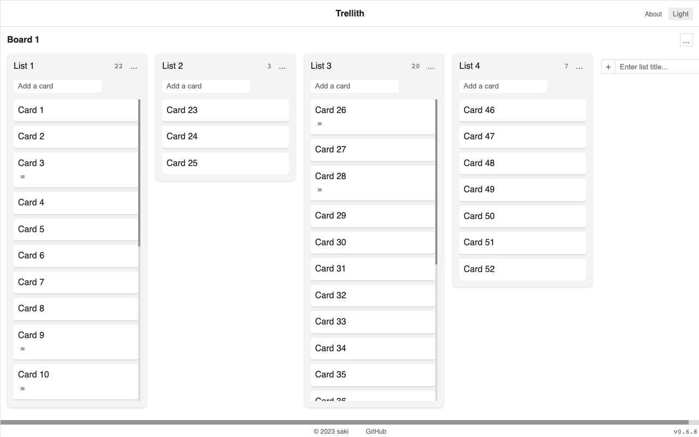
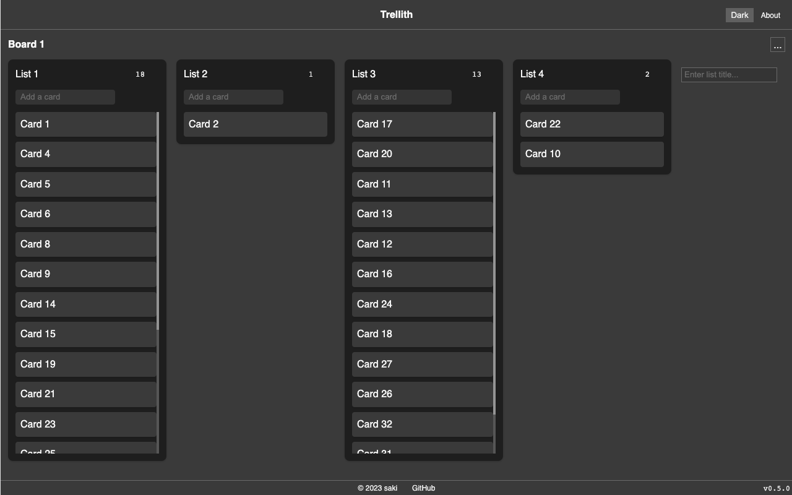
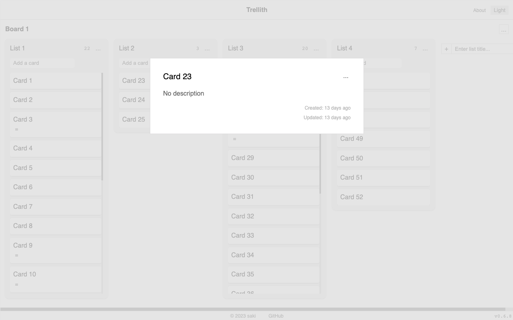
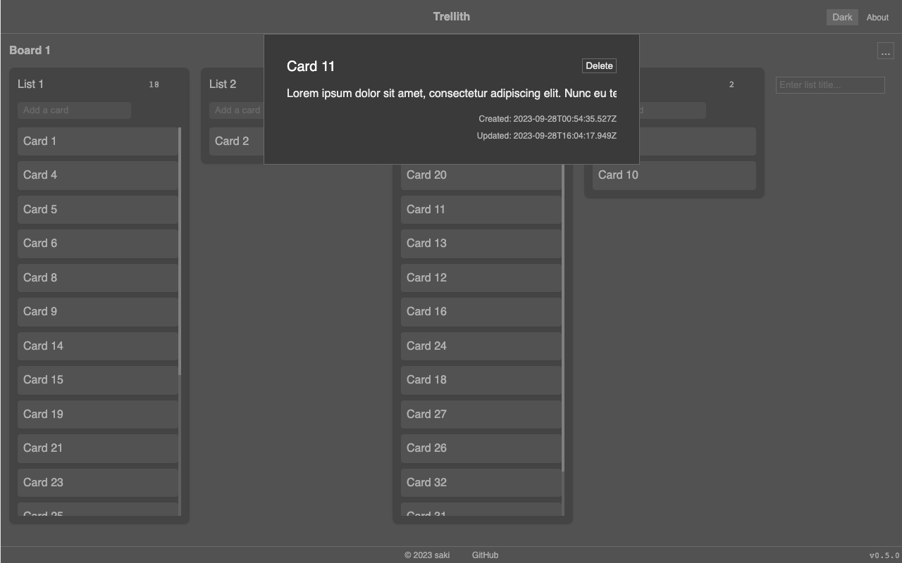
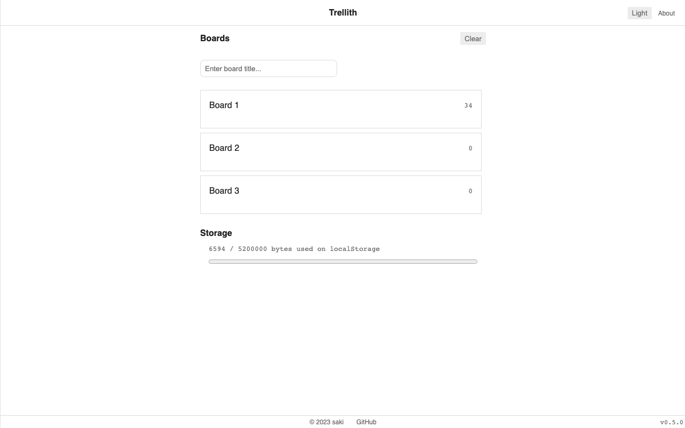
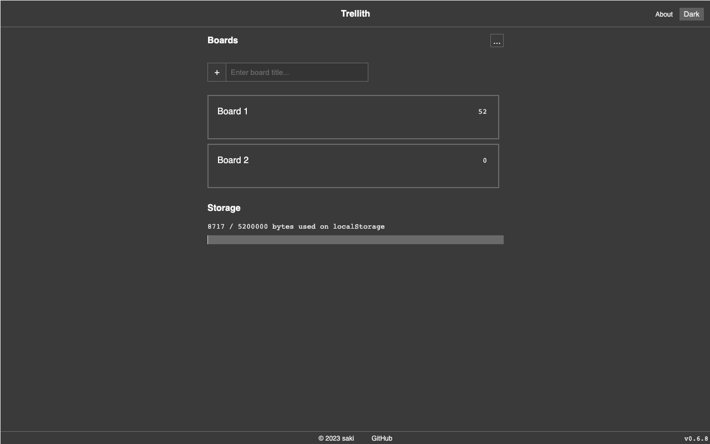

# Trellith

[Trellith](https://trellith.sakih.net/) is an open source, tiny Trello clone PWA built with TypeScript and Preact. It's a personal tool that organizes your projects into boards. You can start using it by just opening the URL. There is no need to create any accounts. Data is only stored in your browser's localStorage. It's secure because the data isn't saved on the cloud.

## Motivation

This is a project aimed at improving frontend and web design skills while creating a practical product.

## Discraimer

Since data is stored in localStorage, the main thread gets blocked, and there is a 5MB size limit.

## Screenshots

||light|dark|
| - | - | - |
|board|||
|card |||
|index|||

## Features

Trellith includes the core features of Trello:

- Create boards
- Create lists
- Create cards
- Rename items
- Sort items by Drag and Drop

Additional features:

- Light Mode / Dark Mode
- Import / Export
- Work offline

## Tech

- [Preact](https://preactjs.com/)
- [Preact Signals](https://preactjs.com/guide/v10/signals/)
- [TypeScript](https://www.typescriptlang.org/)
- [uuid](https://github.com/uuidjs/uuid)
- [Vite](https://vitejs.dev/)
- [Vitest](https://vitest.dev/)
- [vite-plugin-pwa](https://vite-pwa-org.netlify.app/)
- [wouter](https://github.com/molefrog/wouter)

## Contributing

If you find any bugs or have feature requests, please create an issue and let me know.

## License

[MIT](./LICENSE)
