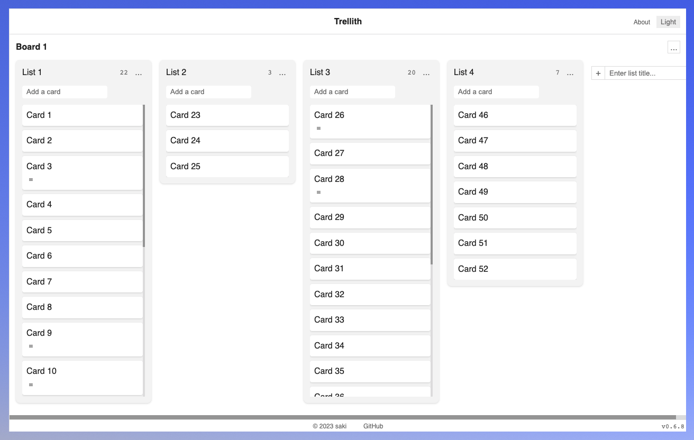

# Trellith
[](https://github.com/sakihet/trellith/actions/workflows/test.yaml)



[Trellith](https://trellith.sakih.net/) is a tiny Trello clone PWA with simplicity. It's a task management tool with a board view format, designed for individuals. You can organize your projects into boards like a kanban using lists and cards.

All you need to get started with the app is to just open the URL. There is no need to create any accounts.

The Data is only stored in your browser's localStorage, not in the cloud. You can own your data.

## Motivation

This is a project aimed at improving frontend and web design skills while creating a practical product.

## Discraimer

Since data is stored in localStorage, the main thread gets blocked, and there is a 5MB size limit.

## Screenshots

||light|dark|
| - | - | - |
|board|||
|card |||
|index|||

## Features

Trellith includes the core features of Trello:

- Create boards
- Create lists
- Create cards
- Rename items
- Sort items by Drag and Drop
- Separator cards

Additional features:

- Light Mode / Dark Mode
- Import / Export
- Work offline

## Tech

- [Preact](https://preactjs.com/)
- [Preact Signals](https://preactjs.com/guide/v10/signals/)
- [TypeScript](https://www.typescriptlang.org/)
- [uuid](https://github.com/uuidjs/uuid)
- [Vite](https://vitejs.dev/)
- [Vitest](https://vitest.dev/)
- [vite-plugin-pwa](https://vite-pwa-org.netlify.app/)
- [wouter](https://github.com/molefrog/wouter)

## CSS

Trellith is designed by Plain Old CSS. It doesn't use any CSS frameworks for minimizing future maintenance costs.

- reset.css
  - Remove default styles
- base.css
  - Add basic styles
- token.css
  - Manage design tokens by CSS custom properties
- utility.css
  - Utility-First CSS
- layout.css
  - Reusable CSS for creating layouts
- pattern.css
  - Reusable CSS for creating common UI

## Icons

[Material Symbols](https://fonts.google.com/icons)

## Contributing

If you find any bugs or have feature requests, please create an issue and let me know.

## Development

```
npm install
npm run dev
```

## License

[MIT](./LICENSE)
