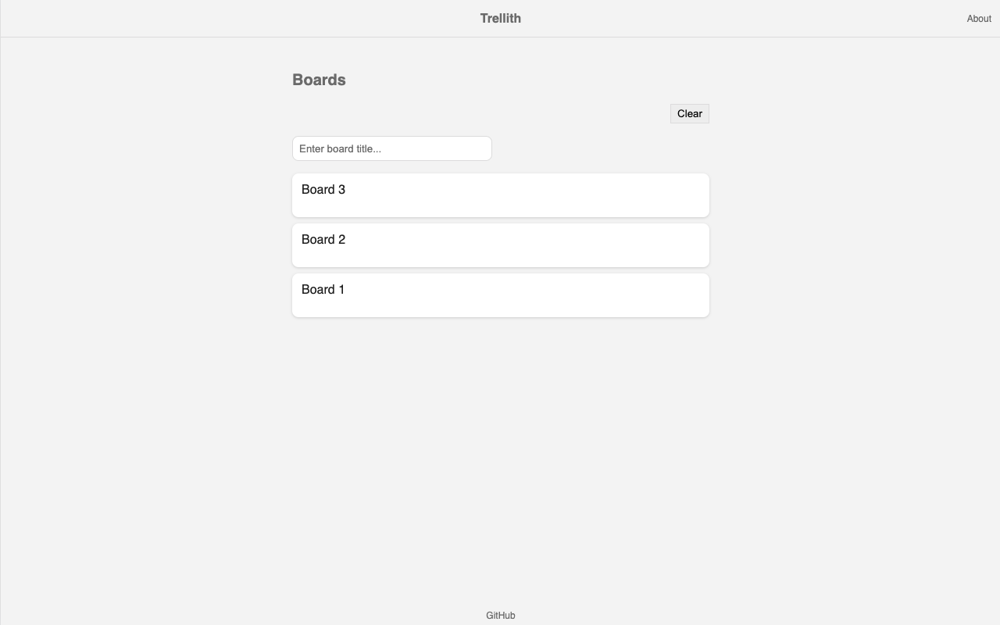
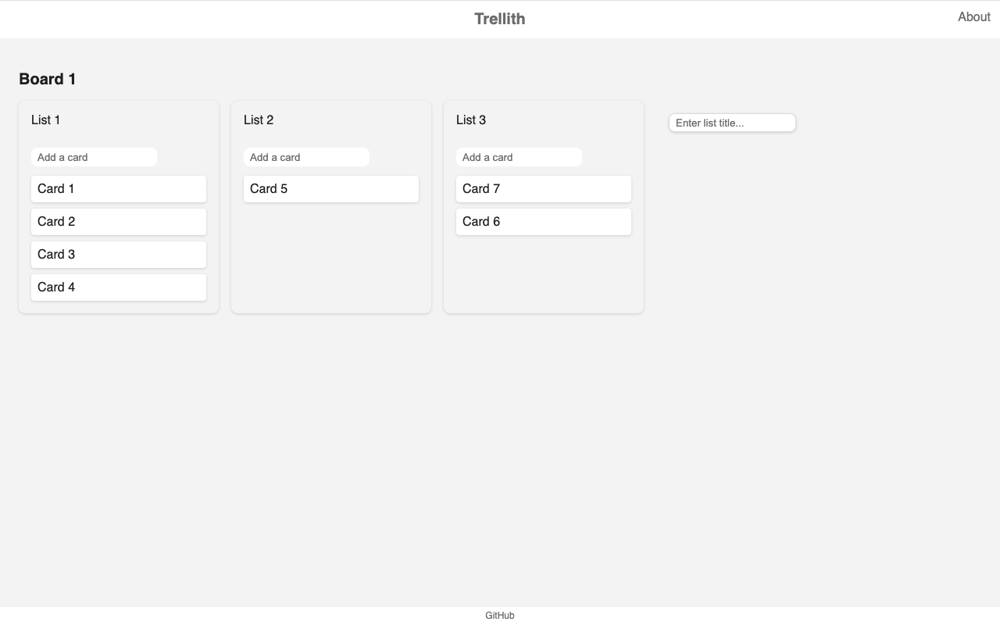

# Trellith

[Trellith](https://trellith.vercel.app/) is an open source, tiny Trello clone PWA tailored for minimalists. You can start using it by opening the URL. There is no need to create any account. Data is only stored in your browser's localStorage.

## Screenshots

## Features

- Create boards
- Create lists
- Create cards
- DnD Board
- DnD List
- DnD Card
- Rename

### TODO

- Fix some bugs
- Refactor

## Tech

- [Preact](https://preactjs.com/)
- [preact-router](https://github.com/preactjs/preact-router)
- [uuid](https://github.com/uuidjs/uuid)
- [Vite](https://vitejs.dev/)
- [Vitest](https://vitest.dev/)
- [vite-plugin-pwa](https://vite-pwa-org.netlify.app/)
